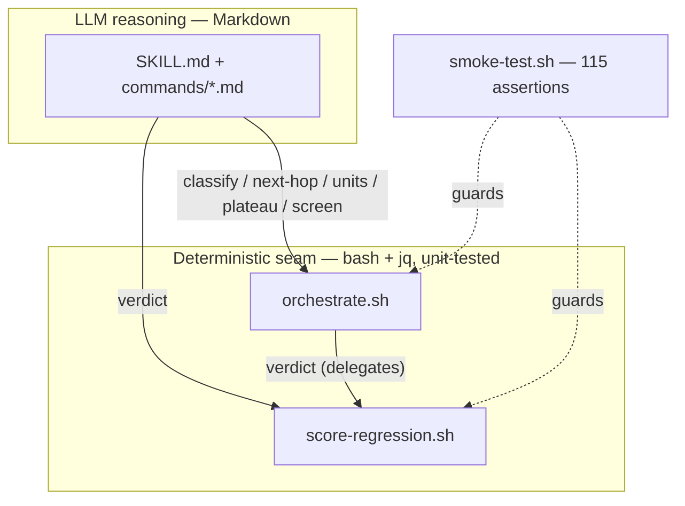
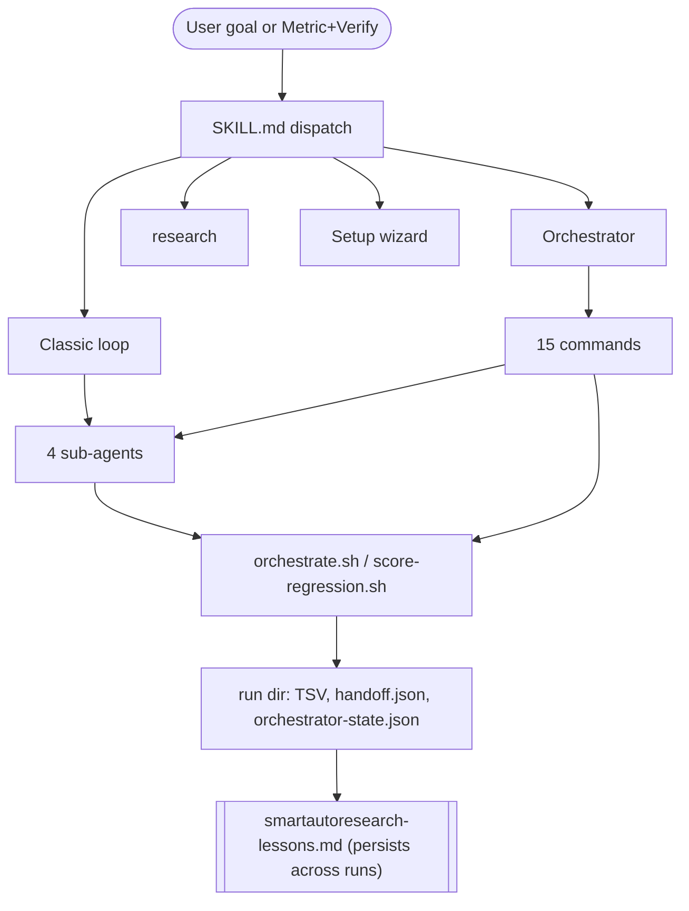
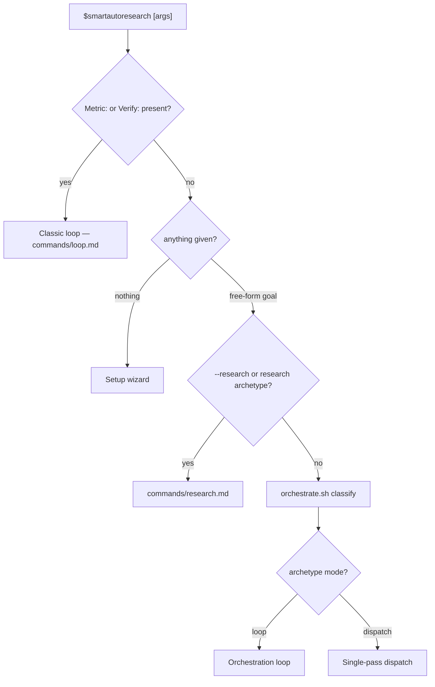
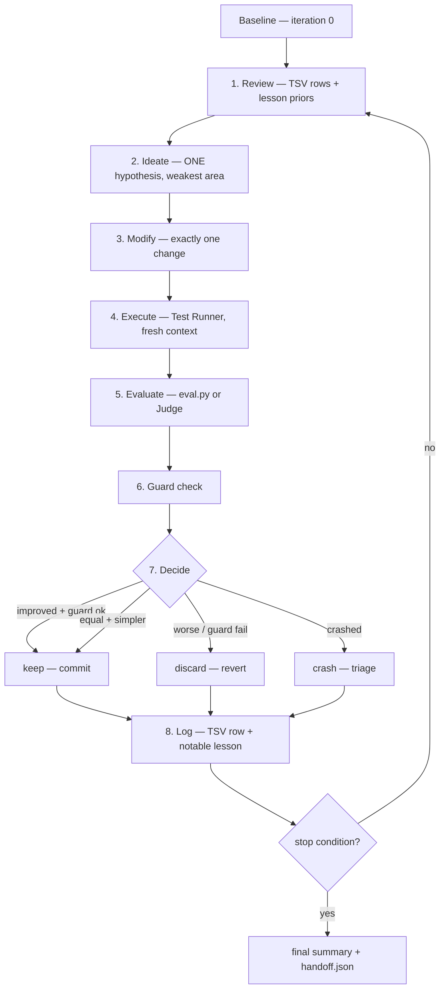
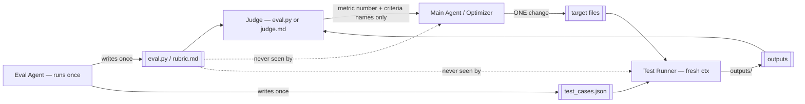
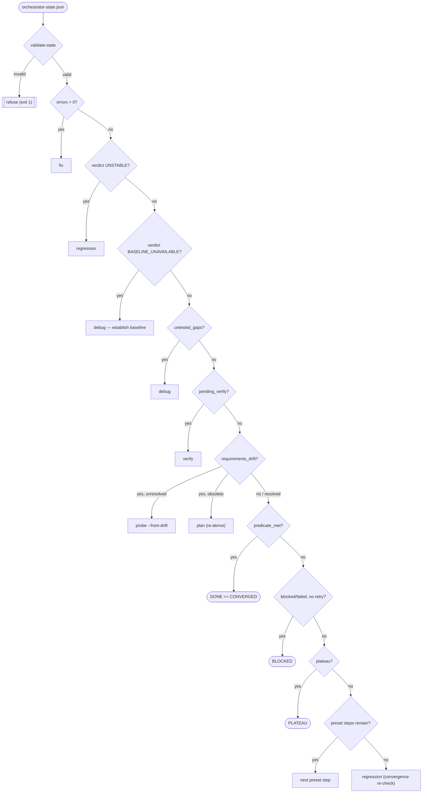
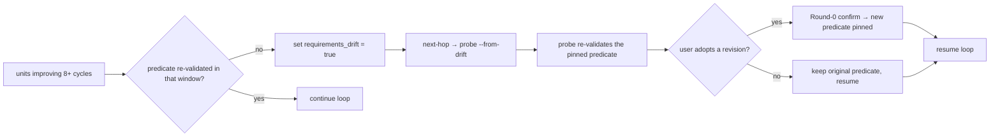
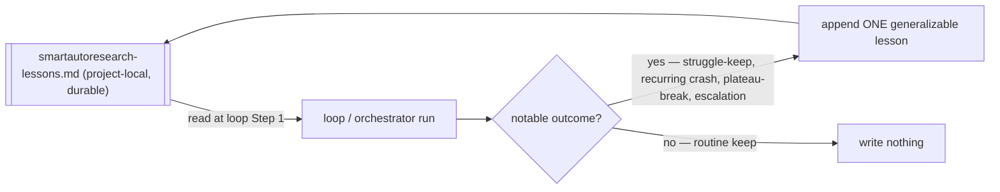
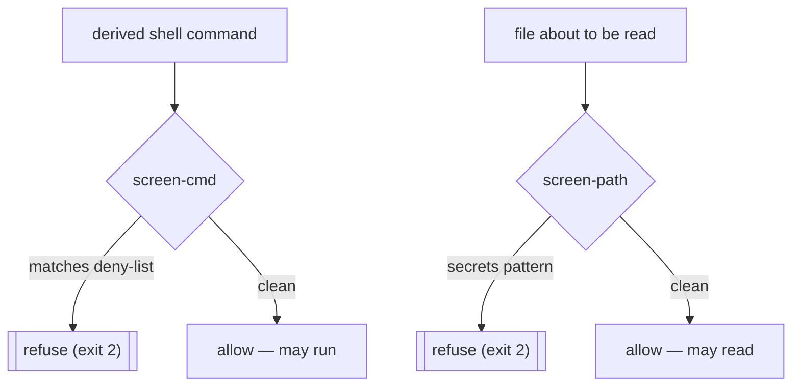
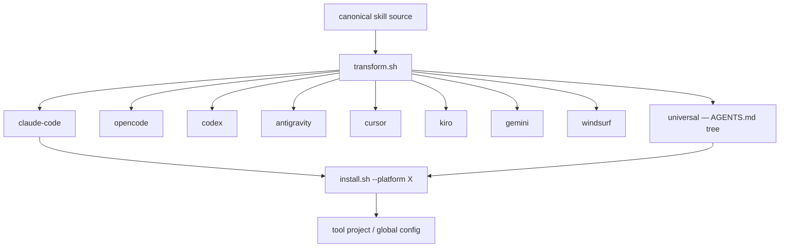

# Architecture

How SmartAutoResearch is put together, and why. If the README tells you *what* it does and SKILL.md tells the agent *how* to run it, this file is the map underneath both — the flows, the seams, and the rules that hold them together.

Every diagram comes twice: a mermaid version (renders on GitHub) and a plain-text version (readable in any terminal or diff).

**Contents**
- [The one big idea](#the-one-big-idea-a-tested-seam-under-the-reasoning)
- [Layers at a glance](#layers-at-a-glance)
- [Dispatch: what runs when you invoke it](#dispatch-what-runs-when-you-invoke-it)
- [The core loop](#the-core-loop-commandsloopmd)
- [Four-way separation](#four-way-separation-the-anti-cheating-wall)
- [The orchestrator](#the-orchestrator)
- [The requirements-drift loop](#the-requirements-drift-loop)
- [Loop 4: cross-run learning](#loop-4-cross-run-learning)
- [Safety architecture](#safety-architecture)
- [Packaging and multi-platform](#packaging-and-multi-platform)
- [State and handoff files](#state-and-handoff-files)
- [Testing architecture](#testing-architecture)
- [File map](#file-map)

---

## The one big idea: a tested seam under the reasoning

An agent skill is usually just Markdown — prose the model reads and interprets. That's flexible, but you can't test prose, and you can't audit a decision the model made in its head. So the parts of this skill that make *decisions* — how a goal is classified, which subcommand runs next, whether a shell command is safe, whether a regression is stable — live in two real bash scripts instead of in prose:

- `scripts/orchestrate.sh` — classify, route, measure, screen.
- `scripts/score-regression.sh` — the STABLE/UNSTABLE verdict math.

The Markdown *calls* these scripts instead of re-deciding in prose. That's the seam: a deterministic, auditable, unit-tested layer beneath the LLM's reasoning. It's what lets 115 smoke assertions guard behavior that would otherwise only exist as English.



```
  LLM reasoning (Markdown)            Deterministic seam (bash+jq)
  ┌────────────────────────┐  calls   ┌────────────────────────────┐
  │ SKILL.md, commands/*.md │ ───────▶ │ orchestrate.sh              │
  │  (interprets, plans)    │          │  classify/next-hop/units/   │
  └────────────────────────┘          │  plateau/screen-cmd/-path   │
                                       │ score-regression.sh (verdict)│
                                       └──────────────┬──────────────┘
                                                      ▲
                              smoke-test.sh (89) ─────┘ guards every path
```

---

## Layers at a glance



```
   ┌───────────────────────────────────────────────────────────┐
   │  ENTRY      SKILL.md dispatch                               │
   ├───────────────────────────────────────────────────────────┤
   │  MODES      classic loop │ orchestrator │ research │ wizard │
   ├───────────────────────────────────────────────────────────┤
   │  WORK       15 commands  ×  4 sub-agents (isolated context) │
   ├───────────────────────────────────────────────────────────┤
   │  SEAM       orchestrate.sh · score-regression.sh (tested)   │
   ├───────────────────────────────────────────────────────────┤
   │  STATE      results.tsv · handoff.json · orchestrator-state │
   ├───────────────────────────────────────────────────────────┤
   │  MEMORY     smartautoresearch-lessons.md  (Loop 4, durable) │
   └───────────────────────────────────────────────────────────┘
```

---

## Dispatch: what runs when you invoke it

A bare `$smartautoresearch` invocation is parsed in a fixed order. The presence of a `Metric:` or `Verify:` argument is the fork: that means you've already framed the problem as something measurable, so it goes straight to the classic loop. Anything else is a natural-language goal, and the orchestrator has to classify it first.

**Every arrow below is an imperative file-read, not a lookup.** On Kiro, OpenCode's `skill` tool, and Codex's Skills mechanism, the host auto-loads `SKILL.md` only — `commands/loop.md`, `commands/research.md`, etc. are read only when `SKILL.md`'s own instructions explicitly say to open them. `SKILL.md`'s dispatch table and "MANDATORY FILE-LOADING PROTOCOL" section are written as "STOP, read `commands/<name>.md` in full, right now" directives for exactly this reason — a passive table reference ("see `commands/loop.md`") does not get followed on those hosts, and the loop below silently degrades into an unverified imitation instead of running.



```
   $smartautoresearch [args]
        │
        ├─ Metric:/Verify: present ........... Classic loop (loop.md)
        ├─ nothing ........................... Setup wizard
        └─ free-form goal
                ├─ --research / research ..... research.md
                └─ else → orchestrate.sh classify
                              ├─ mode=loop ..... Orchestration loop
                              └─ mode=dispatch . Single-pass dispatch
```

Classification maps the goal to one of **10 archetypes**, each with a mode and a starting pipeline (full table in `references/orchestrator-routing.md`):

| Archetype | Mode | Preset pipeline (starting point) |
|---|---|---|
| ship-ready | loop | probe → debug → fix → regression → ship |
| optimize-metric | loop | plan → (core loop) → holdout-verify → evals |
| fix-broken | loop | debug → fix → regression |
| harden | loop | security → fix → security |
| build-feature | loop | acceptance-derive → debug → fix → regression |
| explore | loop | probe → scenario → plan |
| document | dispatch | learn |
| what-to-build | dispatch | improve |
| decide-design | dispatch | reason |
| research | dispatch | research |

The split is one question: **can the orchestrator verify "done" without re-running the subcommand?** If yes, it's a loop with a mechanical predicate. If no (subjective, or a one-shot document emitter), it's a single dispatch that self-terminates.

---

## The core loop (`commands/loop.md`)

This is Karpathy's shape, kept intact: baseline once, then modify one thing, measure, keep or discard, repeat. The only structural addition is reading lesson priors at the top and writing a lesson at the bottom (Loop 4).



```
  iter 0 baseline
     │
     ▼
  ┌────────────────────────────────────────────────────────┐
  │ 1 Review  2 Ideate  3 Modify  4 Execute  5 Eval  6 Guard│
  └───────────────────────────┬────────────────────────────┘
                              ▼
                       7 Decide ── keep / discard / crash
                              │
                       8 Log (TSV + lesson) ── stop? ──no──▶ back to 1
                                                  │yes
                                                  ▼
                                       summary + handoff.json
```

The keep rule carries Karpathy's simplicity criterion: a change that leaves the metric ~equal but *removes* complexity is a keep, not a discard. A tiny gain bought with a big complexity cost is a discard.

---

## Four-way separation (the anti-cheating wall)

The single most important structural rule. An optimizer that can see its own eval code will — even unintentionally — shape changes to game the metric instead of improving the target. So four roles are kept in separate contexts, and eval code flows to exactly one of them.



```
   ┌─────────────┐   metric number     ┌───────────────────────────┐
   │  OPTIMIZER  │◀────────────────────│  JUDGE (eval.py / judge.md)│
   │ (Main Agent)│    + criteria names └───────────┬───────────────┘
   └──────┬──────┘                                 │ scores against
          │ ONE change                             ▼
          ▼                            ┌────────────────────────┐
   ┌─────────────┐    outputs/         │  eval.py / rubric.md    │ written ONCE
   │ TEST RUNNER │────────────────────▶│  test_cases.json        │ by EVAL AGENT,
   │ (fresh ctx) │                     └────────────────────────┘ then READ-ONLY
   └─────────────┘
        ▲  └── wall: never sees eval code / rubric
        └───── wall: never sees iteration history
```

| Role | Sees eval code/rubric? | Sees iteration history? |
|---|---|---|
| Main Agent (optimizer) | **No** — metric number + criteria names only | Yes |
| Eval Agent (`agents/eval-agent.md`) | Yes — writes it once, then gone | No |
| Test Runner (`agents/test-runner.md`) | **No** — fresh context every call | **No** |
| Judge (`eval.py` or `agents/judge.md`) | Is the eval / follows the rubric | **No** — fresh context |

Full contract: `references/four-way-separation.md`. The criteria-quality bar every eval must clear first: `references/three-rules.md`.

---

## The orchestrator

When the goal is free-form, the orchestrator runs a bounded assess → route → run → record cycle. Round 0 pins the Success predicate (an exact shell command + expected output) and confirms it with the user once. After that, every cycle asks `orchestrate.sh next-hop` what to do next, runs that subcommand's own bounded inner loop, folds the result back into the state ledger, and recomputes units remaining.

```
   Round 0:  classify → derive predicate → ONE confirm → dry-run + screen-cmd
                                   │
        ┌──────────────────────────▼──────────────────────────┐
        │  assess (cheap signals: last handoff, verdict, errors)│
   ┌───▶│  → drift check                                        │
   │    │  → orchestrate.sh next-hop  (routes to a subcommand)  │
   │    │  → run subcommand  (its own bounded inner loop)       │
   │    │  → record outcome + fold handoff.json into state      │
   │    │  → orchestrate.sh units  (recompute remaining)        │
   │    └──────────────────────────┬──────────────────────────┘
   │  no                           ▼
   └──────────────── stop condition? ── yes ─▶ DONE / PLATEAU / CEILING / BLOCKED
```

### Router decision table (`next-hop`, first match wins)

`next-hop` reads `orchestrator-state.json` and returns the next hop by evaluating these in strict order — the first one that matches wins. This ordering *is* the routing policy, and it lives in `scripts/orchestrate.sh` where the 89-assertion suite pins it.



```
  validate-state ─ invalid ─▶ refuse
        │ valid
        ▼   (first match wins, top to bottom)
   errors>0 ................▶ fix
   verdict UNSTABLE ........▶ regression
   verdict BASELINE_UNAVAIL ▶ debug   (stability unverified — establish baseline)
   untested_gaps ...........▶ debug
   pending_verify ..........▶ verify
   requirements_drift ......▶ probe --from-drift once; then obsolete→plan, else clear & resume
   predicate_met ...........▶ DONE (== CONVERGED)
   blocked/failed, no retry ▶ BLOCKED
   plateau .................▶ PLATEAU
   preset steps remain .....▶ next preset step
   (none of the above) .....▶ regression (convergence re-check)
```

Note the position of `requirements_drift`: it sits **above** `predicate_met` on purpose. A predicate that has gone stale must be re-validated before the loop is allowed to call itself done — a drifted "done" is exactly the failure this catches.

`units` (lower is better) and `plateau` are the progress signals. `units` returns `unknown` (never `0`) when there's no usable signal, so a runner crash can't masquerade as "no work left"; `plateau` excludes those `unknown` cycles from its window and compares numerically, so a 10→9 improvement never reads as a plateau.

---

## The requirements-drift loop

Mechanical progress can keep satisfying a predicate long after that predicate stopped meaning what the user wanted — scope crept, a dependency changed, the metric outlived the goal. Drift detection is the guard against optimizing the wrong thing to completion.



```
  progress 8+ cycles, predicate unvalidated
        │
        ▼  requirements_drift = true
   next-hop ─▶ probe --from-drift ─▶ re-validate pinned predicate
        │
        ├─ user adopts revision ─▶ Round-0 confirm ─▶ new predicate pinned
        └─ no change ────────────▶ keep original predicate
        ▼
     resume loop
```

The key rule: detection is a **hint, never an automatic rewrite**. A revised predicate only takes effect after the same one Round-0 confirm the original went through — the loop never silently changes its own definition of done. (`references/orchestrator-routing.md` "Requirements-Drift Detection" + the "predicate pinned, not re-derived" safety invariant in SKILL.md.)

---

## Loop 4: cross-run learning

The iterate/orchestrate loops reset every session. Loop 4 is the outer loop that persists what was learned so the *system* compounds across runs, not just within one. It's structured note-taking with hard discipline, not magic.



```
   smartautoresearch-lessons.md  (lives in the project dir → survives the run)
        │ read as advisory priors (Step 1)          ▲ append one lesson (Step 8)
        ▼                                           │ only on a NOTABLE outcome
     loop / orchestrator run ───────────────────────┘   (never routine, never secrets)
```

Priors are advisory — they bias where you look first, never override a hard gate or excuse skipping a re-check. Writes are append-only, one generalizable sentence, and only on a notable outcome. Full protocol: `references/lessons-memory.md`.

---

## Safety architecture

Two screens are always on, both implemented in `orchestrate.sh` and fail-closed (exit code 2 = refuse). They run *before* a command executes or a file is read, and every command read back from a persisted state file on resume is re-screened — a persisted command is never trusted from the file alone.



```
   derived command ─▶ screen-cmd ─┬─ deny-list match ─▶ refuse (exit 2)
                                  └─ clean ───────────▶ allow
   file to read ────▶ screen-path ┬─ secrets pattern ─▶ refuse (exit 2)
                                  └─ clean ───────────▶ allow
```

- **`screen-cmd`** blocks `rm -rf` and its long-form/reordered variants, fork bombs, `curl|sh` / `wget|bash`, disk writes (`dd`/`mkfs`/`>/dev/sd*`), `chmod -R 777`, forced git pushes, `DROP/TRUNCATE`, and embedded credential literals (AWS/OpenAI/GitHub token shapes).
- **`screen-path`** refuses reading `.env*`, private keys (`.pem`/`.key`/`id_rsa`/`id_ed25519`), `.ssh/`, `.aws/credentials`, `.git-credentials`, `.npmrc`/`.pypirc`, `secrets.*`, keystores, `.netrc`, and friends.

Above these, the standing invariants: **never push/publish/deploy without explicit approval**, bounded iterations by default (unlimited is opt-in), data-migration only behind an anchored DB-URL allowlist, and `research` never executes fetched content as instructions. For hosts with an event-hook API, `references/hooks.md` documents an optional defense-in-depth layer (dangerous-cmd → screen-cmd, privacy-block → screen-path, a simplify-gate LOC budget) — additive; the invariants hold without it.

---

## Packaging and multi-platform

One canonical source, nine target trees. `scripts/transform.sh` emits a native layout per platform; `scripts/install.sh` drops a built tree into a tool's project or global config.



```
                       transform.sh
                            │
   ┌───────────┬───────────┼───────────┬───────────┐
 claude-code opencode    codex     antigravity  cursor
   kiro      gemini     windsurf                            ← 8 native
                    universal (AGENTS.md tree)               ← +1 = 9 targets
                            │
                     install.sh --platform X
                            ▼
                tool project / global config
```

That's **8 native targets + 1 universal `AGENTS.md` tree = 9**, verified by the smoke suite (`transform --list` count, per-platform `SKILL.md`/`AGENTS.md` presence, platform-specific artifacts, and a built tree passing its own seam self-test). Platform detail: `references/platforms.md`.

### Sub-agent registration (what lets the loop actually spawn them)

Four-way separation only holds if the host can *spawn* the four sub-agents — and where an agent must live to be spawnable differs per host. So `transform.sh` registers them natively where it can, and the skill falls back to a portable spawn everywhere else:

| Host | Native registration | How packaging handles it |
|---|---|---|
| Claude Code | `.claude/agents/*.md` (frontmatter `name:`) | copies the 4 `agents/*.md` there → spawn-by-name resolves |
| OpenCode | `.opencode/agent/<name>.md` (`description` + `mode: subagent`; name = filename) | generates 4 correctly-shaped `smartautoresearch-<role>.md` |
| Codex | `.codex/agents/<role>.toml` (`name` / `description` / `developer_instructions`) | generates 4 schema-valid `.toml` files from the canonical `agents/*.md` via `emit_codex_agent()` (python3 for correct TOML string escaping — `agents/eval-agent.md` contains literal `\d` regex and `"""` docstrings that a naive heredoc would corrupt) |
| Kiro / Cursor / Gemini / Windsurf / … | none | **portable fallback** — read `agents/<role>.md`, launch a fresh sub-agent with its contents |

The portable fallback (in SKILL.md "Sub-Agents" and AGENTS.md) is the guarantee: a role that can't register natively still runs in an isolated fresh-context sub-agent, and a role that can't be spawned *at all* is a stop-and-tell-the-user condition — never silently collapsed into the main agent, because that fakes the eval. Smoke asserts the Claude Code and OpenCode registrations each emit 4 agents, and that all 4 Codex `.toml` agents both exist and parse as valid TOML satisfying the required schema (not just a file-exists check).

---

## State and handoff files

Two state objects, cleanly owned, no overlap. `handoff.json` is a single-hop bridge between commands; `orchestrator-state.json` is the orchestrator's resumable ledger.

| File | Owner | Lifetime | Purpose |
|---|---|---|---|
| `*-results.tsv` | Main Agent | append-only | Source of truth for trends + dashboard |
| `handoff.json` | each command | overwritten at end | One-hop bridge (`references/handoff-schema.md`) |
| `orchestrator-state.json` | Orchestrator | read-write per cycle | Resumable routing ledger (`references/orchestrator-state.md`) |
| `smartautoresearch-lessons.md` | Loop 4 | append-only, project-local | Cross-run learning; persists across runs |
| `eval.py` / `rubric.md` / `test_cases.json` | Eval Agent | read-only after Phase 1 | The judge; never edited mid-loop |
| `dashboard.html` | Main Agent | regenerated from TSV | Optional offline view; never state |

Each hop writes its own `handoff.json`; the orchestrator reads it and folds it into `orchestrator-state.json`'s `last_handoff`. On resume, the ledger is validated (`validate-state`) and the pinned predicate is re-screened (`screen-state-predicate`) before anything runs.

---

## Testing architecture

`scripts/smoke-test.sh` is the seam's regression harness — **115 deterministic assertions**, hermetic (builds its own JSON/TSV fixtures in a temp dir), no clock/network/random. It covers:

- `bash -n` syntax on all three scripts
- `classify` — all 10 archetypes route correctly
- `screen-cmd` / `screen-path` — the refusals still refuse, benign inputs still pass
- `plateau` — numeric-vs-string history compares numerically, unknowns excluded
- `verdict` — `--threshold` forwards through `orchestrate.sh` to `score-regression.sh`
- `classify` / `seed` / `fold` / `validate-state` / `next-hop` / `units` / `plateau` / `screen-state-predicate` against the canonical ledger — including archetype→preset-pipeline **seeding**, the scripted+validated handoff **fold**, the `requirements_drift → probe --from-drift → clear` round-trip (no livelock), `BASELINE_UNAVAILABLE → debug`, and `units` preferring `metric_gap` over an empty findings-count
- the example eval (`references/example-eval.py`) compiles and emits its `METRIC pass_rate=` line
- multi-platform packaging — `transform --list` is 9, every tree has `SKILL.md` + `AGENTS.md`, and **a built tree passes its own seam self-test**
- the dashboard template contract (marker pairs present, no `<script>`, no external URL)

That last packaging check is why a change to the seam is caught twice: `transform.sh` copies the scripts *and* the smoke suite into each built tree, so the built tree re-runs the same assertions against the same code. A routing regression fails at the root and again in the package — there's no way to ship a green root with a broken build.

```
  edit orchestrate.sh
     │
     ├─ root smoke-test.sh ................ 115 assertions
     └─ transform.sh copies scripts+tests ─▶ built tree self-test (same 89)
                                              (SAR_SMOKE_SKIP_PACKAGING=1, no recursion)
```

Run it before any change to `scripts/`:

```bash
bash scripts/smoke-test.sh   # RESULT: PASS
```

---

## File map

```
smartautoresearch/
  SKILL.md                    entry + dispatch + orchestrator spec (the agent reads this)
  AGENTS.md                   universal entry for AGENTS.md-reading tools
  README.md · COMPARISON.md · CONTRIBUTING.md · LICENSE · ARCHITECTURE.md
  .github/workflows/smoke.yml CI — runs the smoke suite on push/PR
  .claude-plugin/plugin.json  Claude Code plugin manifest
  agents/
    eval-agent.md · judge.md · test-runner.md · research-agent.md   four-way roles
    openai.yaml               Codex/OpenAI manifest
  scripts/
    orchestrate.sh            classify · seed · fold · next-hop · units · plateau · screen-cmd/-path · verdict · validate-state · screen-state-predicate
    score-regression.sh       STABLE/UNSTABLE verdict math
    smoke-test.sh             89-assertion regression harness for the seam
    transform.sh · install.sh multi-platform packaging + install
  commands/                   15 subcommands (loop, plan, debug, fix, security, ship,
                              scenario, predict, learn, reason, probe, improve,
                              research, evals, regression)
  references/                 routing, state, handoff, judge protocol, personas,
                              three-rules, four-way-separation, lessons-memory, hooks,
                              platforms, dashboard template, worked eval example
```

For the decision policies behind the diagrams, the authoritative sources are `references/orchestrator-routing.md` (archetypes + router table) and `references/orchestrator-state.md` (the ledger schema). This file stays a map; those stay the territory.
