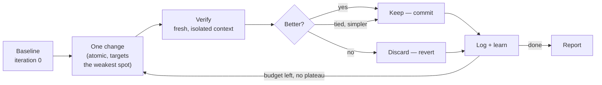

<div align="center">

# 🔬 SmartAutoResearch

**Give your AI agent a goal and a way to measure it — then walk away.**
It changes one thing, tests it, keeps what works, reverts what doesn't, and repeats until the number goes up. You come back to a log of experiments and a better result.

[](./LICENSE)
[](./scripts/smoke-test.sh)
[](./references/platforms.md)
[](https://agentskills.io)

</div>

---

It's the [Karpathy `autoresearch`](https://github.com/karpathy/autoresearch) loop — **modify → verify → keep/discard → repeat** — generalized from ML training to *anything you can put a number on*: test coverage, latency, bundle size, prompt quality, bug count. Point it at a target, define "better," and it runs the experiment loop autonomously: committing before each try, reverting failures, logging everything, and stopping when you say so or the goal is met.

## ✨ Why it's different

- **Any metric, any stack.** If you can measure it with a command that prints a number, you can optimize it.
- **No vibes.** A change is kept only if the metric actually improves — verified by an isolated evaluator that can't see (and can't game) your intent.
- **Doesn't fool itself.** The optimizer, the test-runner, and the judge run in separate contexts. Add an LLM judge for subjective work (tone, writing) with built-in bias guards.
- **Gets smarter over time.** A persistent lessons file means the loop learns across runs, not just within one.
- **Runs anywhere.** One install command for Claude Code, Codex, OpenCode, Cursor, Kiro, Gemini CLI, Windsurf, Antigravity — plus a universal fallback for every `AGENTS.md` tool.

## 👀 What a run looks like

```
● Goal: raise pass_rate on the cold-email prompt   ·   baseline 0.62

  #4  add a specific-number requirement to the CTA     0.62 → 0.71   keep  ✓
  #5  soften the opening line                          0.71 → 0.68   discard ↩
  #6  move the pain-point before the pitch             0.71 → 0.79   keep  ✓
  #7  trim the system prompt by 40%                     0.79 → 0.79   keep  ✓  (simpler wins)
  #8  add three more examples                           0.79 → 0.76   discard ↩

  best so far: 0.79 (+27% over baseline)   ·   8 experiments   ·   3 kept
```

That output is one turn of this loop, on repeat:



Full architecture (dispatch, the four-way wall, the orchestrator, safety screens): [ARCHITECTURE.md](./ARCHITECTURE.md).

## 📦 Install

Clone once, then install for your tool of choice:

```bash
git clone https://github.com/0xTanzim/smartautoresearch
cd smartautoresearch

# native skill install (pick your tool):
scripts/install.sh --platform claude-code --global
#                            codex | opencode | kiro | gemini | cursor | windsurf | antigravity

# project-local install (never prompts):
scripts/install.sh --platform kiro --project .

# non-interactive / CI global install (no TTY available) — pass --yes explicitly:
scripts/install.sh --platform kiro --global --yes

# any other tool (Zed, Copilot, Aider, …) — drops the universal AGENTS.md:
scripts/install.sh --platform universal --project .
```

A `--global` install always asks to confirm before touching your home-dir config; it never proceeds silently on a non-interactive shell — pass `--yes` explicitly if you're scripting it (e.g. CI, dotfiles bootstrap). `--project` never prompts, since it only writes into the directory you named.

**Requirements:** `bash`, `jq`, `awk`, `git`, `python3` — `apt-get install jq gawk git python3` / `brew install jq gawk git python3` (`python3` is only needed to build/verify the Codex `.toml` agents; everything else works without it).
**Verify it's healthy:** `scripts/smoke-test.sh` → `RESULT: PASS`.
**Sub-agents:** the four isolated loop roles register **natively** on Claude Code (`.claude/agents/`), OpenCode (`.opencode/agent/`), and Codex (`.codex/agents/*.toml`) — installing the skill for those three tools makes the roles spawnable by name with zero extra setup. Every other host (Kiro, Cursor, Gemini, Windsurf, and any other `AGENTS.md`/`SKILL.md` tool) spawns them via a documented portable fallback: the agent reads `agents/<role>.md` in full and passes that text as the spawned sub-agent's instructions — same isolation guarantee, no native registration required.

## 🚀 Usage

Trigger it with `/smartautoresearch` (Claude Code / Cursor / Kiro), `$smartautoresearch` (Codex), the skill tool (OpenCode), or just ask your agent to *"run an autoresearch loop."*

### Optimize a metric

```
$smartautoresearch
Goal: cut p95 API latency
Metric: p95 latency in ms   (lower is better)
Verify: npm run bench | grep p95 | awk '{print $2}'
Guard:  npm test            (must stay green)
Iterations: 20
```

It runs the command, changes one thing, re-runs it, keeps the change only if p95 dropped *and* tests still pass — then repeats.

### Just describe the goal (it figures out the rest)

```
$smartautoresearch improve test coverage in the payment module
```

No metric yet? The orchestrator classifies the goal, derives a concrete `Verify` command, confirms it with you once, and loops.

### Optimize a prompt or document (subjective quality)

```
$smartautoresearch
Goal: make my cold-email prompt convert better
Scope: prompts/cold-email.md
--mode ai_judge
```

Switches from a mechanical check to an LLM judge scoring against a rubric — with guards against length, style, and self-preference bias.

### One-liners

```
$smartautoresearch fix                                   # drive test/type/lint errors to zero
$smartautoresearch security                              # STRIDE + OWASP audit, red-team personas
$smartautoresearch research latest rate-limiting best practices   # parallel, dated web research
$smartautoresearch ship                                  # pre-flight checklist → deploy → verify
```

## 🧰 Commands

| Command | What it does |
|---|---|
| *(default)* | The core loop — modify → verify → keep/discard against a metric or rubric |
| `plan` | Turn a fuzzy goal into a validated Scope / Metric / Verify config |
| `debug` | Hunt bugs by hypothesis: guess → test → falsify → repeat |
| `fix` | Crush test / type / lint / build errors one at a time to zero |
| `security` | STRIDE + OWASP audit with adversarial red-team personas |
| `ship` | 8-phase release: checklist → dry-run → deploy → verify |
| `scenario` | Generate edge cases across 12 dimensions |
| `predict` | 5 expert personas debate a change before you build it |
| `learn` | Scout the codebase → generate docs / a wiki → validate |
| `reason` | Adversarial debate with blind judges until it converges |
| `probe` | 8 personas interrogate requirements until they saturate |
| `improve` | Research your users' problems → ranked improvements → PRDs |
| `research` | Parallel, date-stamped web research (feeds the others) |
| `evals` | Analyze a run: trends, plateaus, what worked |
| `regression` | Baseline-vs-candidate stability gate → STABLE / UNSTABLE |

Chain them: `$smartautoresearch debug --fix`, or give a plain goal and let the orchestrator route.

## ⚙️ How it works

1. **Baseline.** Measure where you are (iteration 0).
2. **One change.** Make a single atomic edit targeting the weakest spot.
3. **Verify.** Run your command / score against the rubric — in a *fresh, isolated* context.
4. **Decide.** Better → **keep** (commit). Worse → **discard** (revert). Equal but simpler → **keep**. Crash → triage.
5. **Log & learn.** Append to the run log; on notable outcomes, save a reusable lesson for future runs.
6. **Repeat** until the iteration budget, a plateau, or you stop it.

**Separation of duties** keeps it honest: the optimizer never sees the eval code, the test-runner never sees the criteria, and the judge never sees the history. Nothing can quietly game its own score.

**Safe by default:** every shell command is screened before it runs (`rm -rf`, fork bombs, `curl|sh`, force-push are refused), secret files (`.env`, SSH keys) are never read into context, and it **never** ships or deploys without your explicit approval.

## 🧩 Platform compatibility

Yes, it actually works on Kiro, OpenCode, and Codex — worth knowing *why*, because it's the thing that broke early versions of this skill. Kiro, OpenCode's `skill` tool, and Codex's Skills mechanism all use the same **progressive-disclosure** loading model: the host auto-loads `SKILL.md` only, and loads any other file in the skill (`commands/*.md`, `agents/*.md`, `references/*.md`) *only when SKILL.md's own instructions explicitly tell the agent to open it*. A skill that just mentions those files in a table ("see `commands/loop.md`") never actually gets them read on these hosts — the agent improvises a shallow imitation of the loop instead of running the real one.

`SKILL.md` here is written to avoid that: every dispatch branch is an imperative "STOP, read `commands/<name>.md` in full, right now" instruction, not a passive reference — see the "MANDATORY FILE-LOADING PROTOCOL" section at the top of `SKILL.md`. That's what makes the loop, the orchestrator, and the four-way separation actually execute on Kiro/OpenCode/Codex instead of degrading into a summary-only imitation.

| Host | `SKILL.md` loading | Sub-agent spawning |
|---|---|---|
| Claude Code | on-demand, native | native (`.claude/agents/`) |
| OpenCode | on-demand via `skill` tool, native | native (`.opencode/agent/`) |
| Codex | on-demand ("progressive disclosure"), native | native (`.codex/agents/*.toml`) |
| Kiro | on-demand, native (+ steering pointer) | portable fallback |
| Cursor, Gemini CLI, Windsurf, others | varies — see `references/platforms.md` | portable fallback |

## 🎛️ Common flags

| Flag | Effect |
|---|---|
| `Iterations: N` / `unlimited` | Bounded (default 25) or run until interrupted |
| `--mode ai_judge` | Score with an LLM rubric instead of a mechanical check |
| `Guard: <cmd>` | A safety command that must stay green (e.g. `npm test`) |
| `--evals` | Print progress checkpoints during the run |
| `--chain <cmd,…>` | Hand off to other subcommands when done |

## 📄 License

[MIT](./LICENSE). Built on the loop from [karpathy/autoresearch](https://github.com/karpathy/autoresearch) and the orchestrator lineage of [uditgoenka/autoresearch](https://github.com/uditgoenka/autoresearch).

<div align="center">
<sub>Set a goal. Define better. Let it run.</sub>
</div>
